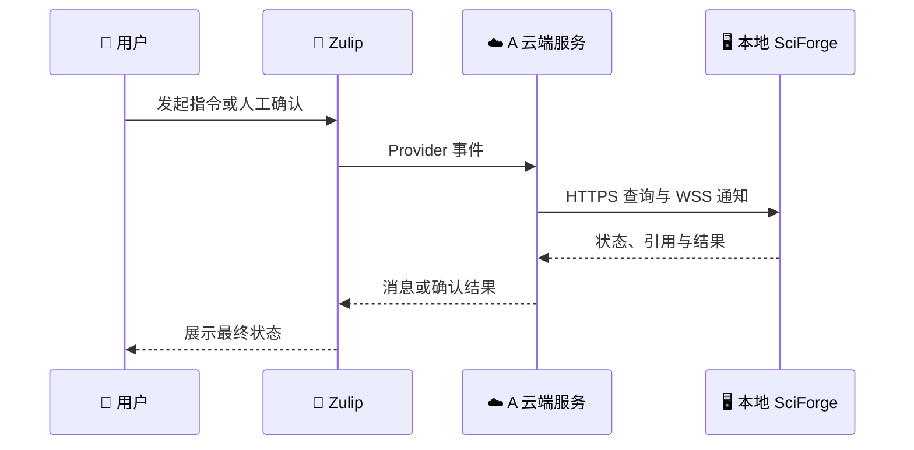

# A 云端协同服务职责与开放就绪状态

> 状态日期：2026-08-17（Asia/Shanghai）
>
> 分工依据：《SciForge 多客户端协作 MVP 五人分工报告》2026-08-16 对齐结论
>
> 文档状态：A 内部收口基线；未宣告新 A 已完成公网切换或业务开放

## 📋 结论

A 的交付物是协作控制面，而不是另一套 Agent、Coordinator、手机端或内容 Provider。A 负责在云端保存唯一权威状态、提供最小公共接口、维护安全路由和完成总集成；B–E 各自保留模块内部决策与实现。

当前新 A ECS 已能以 loopback 模式运行固定版本，数据库和核心 API 可用，但 canonical HTTPS 仍指向 legacy 协作服务。新 A 的正式 Zulip Provider、简易网页控制台、真人确认门禁以及“最新版 SciForge 经真实生产链路执行任务”的验收仍未全部完成。因此，可以继续做 A 自己的收口和服务器 conformance，尚不能把新 A 宣布为已开放的产品环境。

## 🌐 唯一产品链路

产品 canonical URL 是 `https://chat.sciforge.cn/collaboration/`。最新版 SciForge 的本地协作领域只经 A 的 HTTPS/WSS 公共接口连接云端；Zulip Provider/adapter 运行在 A 云端服务侧，本地 SciForge 不直接调用 Zulip。`47.76.230.118` 上的 `127.0.0.1:8787` 和 SSH tunnel 仅用于新 A 的预发布验证，不能成为第二条产品路径。

`origin/gui` 中的桌面协作领域、AgentRuntime、个人 Session 投影与六用户场景是既有跨团队 baseline，用于最终系统验收；它们不是 A 本轮重新实现或开放云服务的前置条件。A-only gate 只覆盖云端合同、server/Provider、A 简易控制台、部署/恢复、公共 API 和 canonical HTTPS 真实接线；六用户 API-key harness 若运行，只能使用专用 QA 账号，不收普通成员密钥，也不代表最新版 SciForge E2E。

## 🎯 A 负责什么

| A 的责任 | 最小交付 |
| --- | --- |
| 云端权威状态 | User、Human—设备绑定、Project、成员、Task、消息、进度、能力目录、人工确认、ResourceRef、路由和结果状态 |
| 公共接口 | 版本化 HTTP command/query、WSS 新事件通知、Inbox 补取/ACK、统一错误、幂等和 revision |
| 身份与权限 | Zulip Human pairing、Agent enrollment、凭据撤销、操作者审计和最小权限校验 |
| Task 执行授权 | 同一 Task 同时只有一个执行节点；人工确认后改派；旧节点不能继续提交 |
| 持久化与可靠性 | PostgreSQL migration、事务、并发约束、审计、备份、恢复和数据库重启降级 |
| A 网页控制台 | 项目创建、成员选择、任务/进度/消息查看和人工确认入口；只调用 A 的公共接口 |
| 合同与总集成 | 最小公共合同、版本和变更记录，以及节点注册、能力上报、Task 路由、状态和结果回传的可运行示例 |
| 云端部署 | 新 ECS 资源、安全边界、canonical HTTPS、Provider 运行和开放门禁 |

## 🚫 A 不负责什么

| 模块 | 模块负责人拥有 | A 只提供的边界 |
| --- | --- | --- |
| B 项目协调工作流 | 目标理解、Task 拆分、执行者推荐、结果业务判断、总结和真人确认流程 | 保存权威状态并执行已经确认的 command；不在云端运行 Coordinator |
| C 节点接入与执行 | 节点协议/SDK、桌面与机构服务器适配、Task 领取和本地执行 | 公共 Agent、能力、Inbox、状态与结果接口；不访问本地文件、VPN、GPU 或 Slurm |
| D Computer Use 与稳定性 | CDP、UIA、isolated desktop、跨端稳定性和复杂环境验证 | 可观测的消息、身份、撤销、重放和权限边界；不复制 Computer Use 或手机端实现 |
| E OpenContent | 逐用户账号连接、附件/Shared Document Provider、正文和安全写入 | 只保存必要 ResourceRef 元数据；不保存正文、附件、OpenContent 凭据或 Provider 私有状态 |

A 也不为各板块增加专用状态机、中央枚举分支或第二套消息路径，不代替项目负责人作最终结论、重新分派或取消决定。

## 📊 当前真实状态

以下是 2026-08-17 对部署和代码的只读核验快照。后续发布必须用新的固定 commit 和发布清单覆盖本表，不能沿用“已验证”字样。

| 项目 | 当前事实 | 含义 |
| --- | --- | --- |
| 新 A ECS | `47.76.230.118`；app 固定在 commit `3725cea58dbf049923c1c216d59acade7f2aa6c5` | 新 A 预发布实例存在 |
| 新 A 网络 | app 仅发布到 `127.0.0.1:8787`；PostgreSQL 不发布；公网仅受限 SSH | 隔离边界正确，但不是产品入口 |
| 新 A 探针 | `/healthz` 与 `/readyz` 返回 200 | app 与数据库当前可用 |
| 新 A Provider | core-only，Provider catalog 为 `[]`，Provider diagnostics 为 0 | 尚未接入正式 Zulip 入站事件 |
| 新 A 业务数据 | User、Agent、Project、Task 均为 0 | 尚未完成正式 pairing 与真实业务闭环 |
| 数据库重启 | app 容器/PID 未随 PostgreSQL 重启，readiness 可恢复；连接池日志已脱敏验证 | 服务器可靠性门禁已有证据 |
| 公共 API | 合同、PostgreSQL、HTTP/WSS、Inbox、幂等、审计、能力查询与任务路由已存在 | 可继续做 A 的 conformance，不等于产品 E2E |
| 自动化驱动 | 可用两名测试用户、三个测试 stream 和公开 API 做服务器协议验收 | 测试夹具不是成员接入前置，也不冒充最新版 SciForge |
| 网页控制台 | 当前固定部署未包含；本分支正在补齐 A-only 同源控制台 | 需随新的固定版本部署和验证，不是永久延期项 |
| 真人确认门禁 | 当前固定版本尚未对首次分派、改派、取消和最终结论形成完整统一门禁 | 未满足最新共同原则 |
| canonical HTTPS | `https://chat.sciforge.cn/collaboration/` 当前仍是 `47.243.145.156` 上的 legacy 合同 | 不能声称新 A 已经切换 |
| 真实产品 E2E | 尚无“Zulip → 新 A → 本地最新版 SciForge → 新 A → Zulip”的完整证据 | 业务测试尚未开放 |

## ✅ 开放业务测试门槛

只有以下事项同时通过，A 才通知 B–E 使用正式公共接口：

- [ ] 为新 A 发布新的固定 commit、release manifest 和可回退备份，工作树与发布物一致。
- [ ] `https://chat.sciforge.cn/collaboration/` 受控切换到新 A，TLS、HTTP、WSS、base path 和版本探针一致；旧服务隔离但可短期回退。
- [ ] 新 A Zulip Provider catalog 仅包含预期 Provider，Bot 认证成功，且存在本次启动后的脱敏健康诊断。
- [ ] 正式 Zulip pairing 能创建 User/Human Endpoint；不通过 SQL seed、隐藏后门或共享个人 API key 建立身份。
- [ ] Project Owner 凭据是首次分派、换 assignee 主动改派、取消和最终结论的统一人工确认边界；Coordinator 只可对 `failed/rejected` Task 发起同 assignee 重试。
- [ ] A 的简易网页控制台能完成项目创建、成员选择、任务/进度/消息查看和人工确认。
- [ ] 最新版 SciForge 只经 canonical HTTPS/WSS 完成节点注册、能力上报、Task 领取、状态更新和结果回传。
- [ ] 一条真实云端闭环覆盖“项目创建 → 能力查询 → Task 分派 → 节点领取 → 结果回传 → 人工查看”。
- [ ] 断线重放、幂等、Owner 对非终态 Task 主动改派、并发改派、旧节点拒绝、待回答 HumanRequest 过期、凭据撤销、PostgreSQL 重启、备份恢复和敏感日志扫描通过。
- [ ] 8787 与 PostgreSQL 仍不对公网开放；所有成员只使用公开协议，不访问 A 数据库。
- [ ] 接口说明、真实调用示例、协议版本、固定 commit 和已知问题一致。

## 🔐 A 基础设施侧仍需要的输入

A 无需等待 B–E 的模块方案即可完成上述服务器与产品链路收口。当前真正需要协调的是 A 基础设施权限和非聊天方式的 secret 注入：

1. `chat.sciforge.cn` 反向代理配置的维护权限、切换窗口、回退负责人和旧服务隔离策略。
2. 新 A 专用 Zulip Bot 的非敏感身份信息，以及由有权限管理员把 Bot API key 直接写入 ECS 受限 secret 文件；密钥不发聊天。
3. 用于 A 自验的两个真实 Zulip 测试身份。个人 API key 仅在选择运行可选自动化 conformance 驱动时，由各自持有人放进本机 `0600` 文件；它不是产品运行条件。
4. 新 A 固定发布物、数据库和 canonical URL 的备份、监控与故障联系窗口。

## 👥 B–E 何时需要提供什么

在 A 尚未满足开放门槛时，B–E 不需要提交私钥、API key、Bearer、数据库访问、模块源码或内部数据结构；他们可以独立完成各自模块。A 也不应把可选的两用户自动化测试拓扑变成团队前置任务。

正式入口开放并发布版本后，每位成员只需提供真实公共边界上的最小信息：

| 成员 | 开放后给 A 的最小信息 | 不应给 A 的内容 |
| --- | --- | --- |
| B | 一组真实 Task 提议/推荐、真人确认、结果判断的公开请求与响应；必要缺失字段 | Coordinator prompt、模型凭据、内部工作流状态 |
| C | 一组真实 Agent 注册、能力、领取、状态和结果 payload；节点类型与允许公开的能力摘要 | 本地路径、完整日志、VPN/GPU/Slurm 凭据或 AgentRuntime 内部对象 |
| D | 一组跨端身份/撤销/消息重放的复现步骤、期望结果与实际错误 | Computer Use 实现、桌面控制凭据或个人 API key |
| E | 一组真实 ResourceRef 元数据、状态变化和失效样例；必要缺失字段 | 附件/正文、OpenContent token 或逐用户 Provider 私有状态 |

若某成员确需预发布低层 tunnel 诊断，再单独提供其 SSH 公钥和当前公网出口 `/32`；这是可撤销的临时诊断权限，不是正常成员登录方式。

## 📍 A 接下来的顺序

1. 先冻结 A-only 合同和真人确认规则，补齐简易网页控制台与真实调用示例。
2. 在新 A loopback 环境完成 Provider、PostgreSQL 和服务器 conformance，不把驱动结果称为 SciForge E2E。
3. 发布新的固定版本并备份，受控把 canonical HTTPS 切到新 A。
4. 使用最新版 SciForge 和真实 Zulip 身份完成唯一产品链路验收。
5. 门槛全部通过后再向 B–E 发布版本、入口、示例和已知问题；他们返回实际公共 payload，A 只做兼容性收敛和总集成。

相关运行记录：

- [新 A loopback 预发布说明](../deploy/collaboration-private/README.md)
- [既有 47.243 ECS legacy 运行记录](operations/zulip-aliyun-deployment.zh-CN.md)
