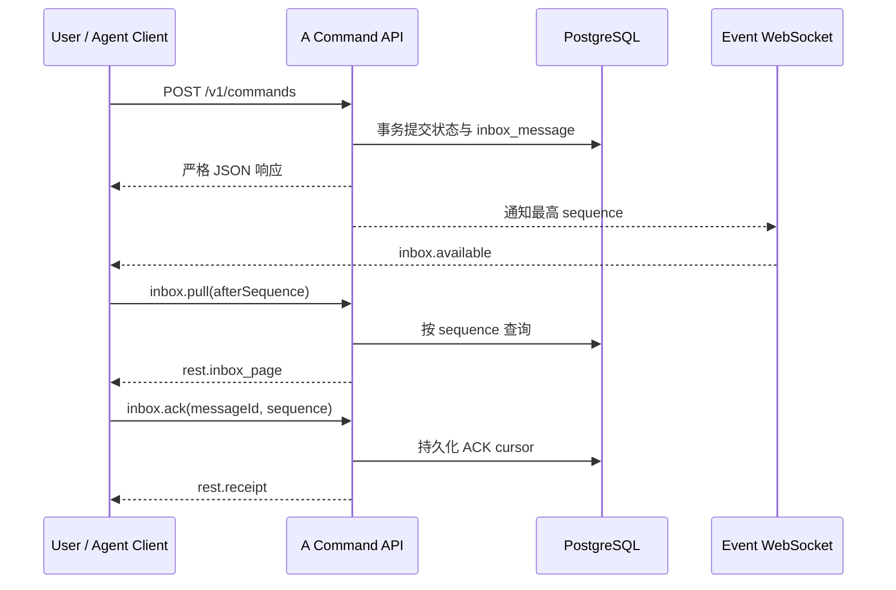

# SciForge A 云端协作最小公共 API

_面向 A 自身 MVP 与后续适配器联调；协议版本 `1.0`，示例地址不代表任何已部署公网服务。_

---

## 📋 文档范围与状态

本文只描述 A 云端协作核心对外交换的数据，不描述 B、C、D、E 各自模块的内部实现。示例统一使用：

```text
https://collaboration.example.invalid
```

这是保留域名示例，不表示域名、TLS、provider adapter 或 ECS 公网入口已经部署。本文中的能力状态含义如下：

| 标记 | 含义 |
|---|---|
| 当前可用 | 已存在严格合同与 HTTP 分发，可在部署后按本文调用 |
| 本地已验收 | 严格合同、HTTP 分发、持久化实现与自动测试均已通过；是否已部署由运维状态另行说明 |
| 依赖 provider | A 已定义边界，但必须由经过验证的 provider gateway 调用；本文不承诺 provider 已部署 |
| 暂无公开能力 | A 没有对应公共 command；调用方不得依赖数据库、内部 service 方法或私有结构替代 |

A 核心只保存协作所需身份、项目、任务、持久 Inbox、人工确认、共享记录和资源引用。A 不运行 Agent，不读取本地文件，不保存完整私人对话、工具日志、资源正文、长期凭据、本地绝对路径，也不替项目负责人作最终决定。

## 🌐 唯一业务入口

正式产品链路中，Zulip 事件由 A 云端 Provider/adapter 解析并写入本公共边界，本地最新版 SciForge 只通过 A 的 HTTPS/WSS 交换任务、状态和结果，不直接调用 Zulip。返回方向为“本地 SciForge → A 云端服务 → Zulip”；SSH tunnel 只是服务器预发布诊断手段，不是第二个产品入口。

除健康检查外，所有业务查询和写操作都通过同一个严格信封发送：

| 用途 | 方法与地址 | 说明 |
|---|---|---|
| 业务命令与查询 | `POST https://collaboration.example.invalid/v1/commands` | 由 JSON 的 `type` 区分 command；不存在 `/v1/projects`、`/v1/tasks` 等独立 REST 路由 |
| 实时唤醒 | `GET wss://collaboration.example.invalid/v1/events` | WebSocket Upgrade；只通知 Inbox 有新消息，不传递完整领域事实 |
| A 网页控制台 | `GET https://collaboration.example.invalid/console/` | 同源薄控制面；凭据仅存页面内存，不提供 B–E 私有业务逻辑 |
| 存活检查 | `GET https://collaboration.example.invalid/healthz` | 仅表示进程可响应 |
| 数据库就绪检查 | `GET https://collaboration.example.invalid/readyz` | 只表示数据库 schema 与关键约束就绪；Provider 健康由部署门禁独立检查 |

所有请求至少包含：

```json
{
  "protocolVersion": "1.0",
  "requestId": "req_demo0000000001",
  "type": "project.get",
  "projectId": "prj_demo0000000001"
}
```

`requestId` 用于关联一次请求与响应，不负责幂等。ID 是不透明字符串，客户端不得解析其中含义。

## 🔐 认证、actor 与并发控制

### Actor 由凭据解析

普通认证请求使用：

```http
Content-Type: application/json
Authorization: Bearer <credential>
```

服务器从认证凭据解析 actor。请求体中的 `ownerUserId`、`senderUserId`、`assigneeAgentId` 等字段只是目标或关联字段，不能自报 actor，也不能扩大权限。

| 公共 actor | 凭据来源 | 可用边界 |
|---|---|---|
| anonymous | 无凭据 | 仅 `endpoint.catalog.get`、`pairing.begin`、`pairing.redeem`，并受匿名限流；`pairing.begin` 只接受 catalog 中正在运行的 provider |
| user | 用户凭据 | 用户本人资料、项目 owner 操作，以及作为 active Project member 的读取/提交 |
| agent | Agent 注册后一次性返回的设备凭据 | Agent 心跳、Coordinator 操作、当前 assignee 的 Task 操作和 Agent Inbox |
| human_endpoint | provider gateway 验证后的身份 | `pairing.verify` 的 provider 事件处理、`project.input.create`、`human.answer` 等 provider 边界；不是普通 Bearer 客户端可伪造的 actor |

`system` 是服务内部 actor，不属于公共调用方。凭据不得放在 URL、请求 JSON、日志或 ResourceRef 中。

### 幂等写入

每个写 command 同时携带 HTTP 头和 JSON 字段，二者必须完全一致：

```http
Idempotency-Key: idem_project_create_demo_0001
```

```json
{
  "protocolVersion": "1.0",
  "requestId": "req_demo0000000002",
  "type": "project.create",
  "idempotencyKey": "idem_project_create_demo_0001"
}
```

同一 actor、同一 `Idempotency-Key`、同一业务有效载荷重试时通常返回既有结果；用于关联单次 HTTP 请求的 `requestId` 可以改变，不属于幂等业务有效载荷。同一个 key 对应不同业务有效载荷时返回 `idempotency_conflict`。返回 pairing secret、user credential 或 Agent device credential 等一次性材料的 command 不会重放明文，重复 key 会返回 `idempotency_conflict`，调用方必须重新开始相应注册流程。读取 command 没有 `idempotencyKey`，也不发送 `Idempotency-Key` 头。

### Revision 乐观并发

修改既有实体的 command 必须携带调用方最后读取到的 `expectedRevision`。成功写入通常将实体 `revision` 加一；过期 revision 返回 `revision_conflict`。创建类 command 是否携带 revision 取决于它保护的并发边界，例如 `task.create.expectedRevision` 保护 Project revision；task-scoped `resource.create.expectedTaskRevision` 则保护 ResourceRef 的 Task 授权与 provenance。

客户端收到冲突后应重新读取实体、重新判断用户意图，再用新的幂等 key 提交；不要盲目覆盖。

## 🧭 十二类核心能力

下表中的“响应”均是 `POST /v1/commands` 的 JSON 响应。`rest.entity` 表示响应体的 `entity` 是严格公共实体，而不是数据库行。

| 能力 | Command / Query | 认证 actor | 成功响应 | 当前边界 |
|---|---|---|---|---|
| 1. 用户 | `pairing.begin`、`pairing.redeem`；`user.get`、`user.update` | 前两者 anonymous；后两者为同一 user，生命周期降级需要相应 assurance | `pairing.begun` / `pairing.pending` / `pairing.verified`；`rest.entity(user_principal)` | 当前可用；`user.create` 虽有合同名，但 HTTP 明确拒绝，用户只由首次已验证绑定创建 |
| 2. Human—设备绑定 | `endpoint.challenge.create`、`endpoint.transition`、`endpoint.transfer`；`agent.register`、`agent.heartbeat`、`agent.rotate_credential`、`agent.owner.transfer`、`agent.revoke`；`credential.revoke_current`；`participant.get`、`participant.update_primary` | 绑定 owner user；心跳为对应 agent；当前 user/agent Bearer 只能撤销自身；Participant 仅本人 | `pairing.begun`、`rest.entity(...)`、`participant.snapshot` 或 `rest.receipt`；注册/轮换凭据只在成功响应中返回一次 | 当前可用，但绑定闭环依赖 provider；`pairing.verify` 与 `endpoint.bind` 不能由普通 HTTP 客户端直接调用 |
| 3. 项目 | `project.create`、`project.get`、`project.transition`、`project.transfer_coordinator`；可选 provider 映射为 `project.endpoint.bind/update/get` | 创建、状态和 Coordinator 变更为 owner user；读取为 active member 的 user 或 agent | `rest.entity(project)` 或 `rest.entity(project_endpoint_binding)` | 当前可用；没有 `project.list` |
| 4. 成员 | `project.create.memberUserIds`；`project.get` | 创建为 owner user；读取为 active member | `project.memberUserIds` | 当前只支持创建时固定成员；没有成员 add/remove、角色修改或独立成员列表 command |
| 5. Task | `task.create`、`task.get`、`task.transition`、`task.retry` | 创建、换 assignee 改派和 `cancelled` 为 Project owner user；同 assignee 重试为 owner user 或当前 Coordinator Agent；读取为 active member；执行状态更新通常为当前 assignee Agent | `rest.entity(task)` | 当前可用；同 assignee 重试仅接受 `failed/rejected`；Owner 换 assignee 可从 `offered/accepted/running/needs_human/failed/rejected` 主动改派，`succeeded/cancelled` 拒绝；没有 `task.list` |
| 6. 消息 | `project.input.create`、`projection.message.publish`、`inbox.pull`、`inbox.ack` | Project 输入为 verified `human_endpoint`；投影发布为所属 agent；Inbox 为对应 user 或 agent | `rest.entity(project_input)`、`rest.receipt`、`rest.inbox_page` | 合同当前存在；前两者的端到端交付依赖 provider adapter；A 不提供完整聊天历史查询 |
| 7. 进度 | `task.progress.report` | 当前 assignee Agent；Task 必须为 `running` | 更新后的 `rest.entity(task)`，含 `progress` | 当前可用；只接受 `percent` 与安全摘要，不接收日志或 transcript |
| 8. 能力查询 | `project.capability_directory.get` | 该 active Project 的 active member user 或 agent | `rest.entity(project_capability_directory)` | 当前可用；只返回 active Agent 的公共能力，不提供全局 Agent 目录 |
| 9. 人工确认 | `human.needed.create`、`human.answer` | 前者为当前 assignee Agent，目标必须是 active member；后者仅为目标用户对应的 verified `human_endpoint` | `rest.entity(human_needed)`、`rest.entity(human_answer)`，同时产生持久 Inbox 消息 | `human.needed.create` 在同一 Task 上将 `running` 改为 `needs_human` 并递增 Task revision；回答不会自动恢复 Task |
| 10. 资源引用 | `resource.create`、`resource.get`、`resource.invalidate` | active Project member 的 user 或 agent；读取为任意 active member；Worker Agent 写入必须绑定自己已接受的 active Task | `rest.entity(resource_ref)` | 本地已验收；只接受元数据与 HTTPS 引用，并保存 actor 与 Task revision provenance |
| 11. 任务路由 | `task.create` 或 `task.retry` 后向当前 assignee 写入唯一 `task.offered`；assignee 用 `inbox.pull`、`task.get` 获取工作 | 首次分派与换人改派为 owner user；同一 assignee 重试为 owner user 或 Coordinator Agent；目标为 active member 所属 active Agent | 更新后的 Task；路由结果为有序 `inbox_message` | 当前支持首次路由、失败同节点重试和 Owner 对非终态/失败 Task 的主动改派；没有独立 Assignment 实体 |
| 12. 结果回传 | `task.transition(status="succeeded", resultSummary=...)`；需要共享记录时使用 `project_record.submit/get/accept`；产物另建 ResourceRef | Task 结果为当前 assignee Agent；Record 提交/读取为 active member user/agent；`observation/task_result` 可由 owner 或 Coordinator 验收，`proposal/decision/summary` 仅 owner 验收 | 更新后的 Task；`rest.entity(project_record)`；可关联 `resource_ref` | 当前可用；没有独立 `TaskResult`、`evidenceRefs` 或正文上传 |

### 本分支新增的冻结字段

`project.capability_directory.get` 请求固定为：

```json
{
  "protocolVersion": "1.0",
  "requestId": "req_demo0000000003",
  "type": "project.capability_directory.get",
  "projectId": "prj_demo0000000001"
}
```

成功响应的实体固定为：

```json
{
  "protocolVersion": "1.0",
  "requestId": "req_demo0000000003",
  "type": "rest.entity",
  "entity": {
    "schemaVersion": 1,
    "type": "project_capability_directory",
    "projectId": "prj_demo0000000001",
    "projectRevision": 3,
    "agents": [
      {
        "agentId": "agt_demo0000000001",
        "ownerUserId": "usr_demo0000000001",
        "displayName": "分析节点",
        "nodeType": "desktop",
        "capabilities": ["agent-runtime", "local-files"],
        "connectionStatus": "online",
        "lastSeenAt": "2026-08-16T12:00:00Z",
        "revision": 4
      }
    ]
  }
}
```

目录只包含 Project active member 所属的 active Agent。不得返回 `installationId`、`credentialVersion`、human endpoint 或任何凭据。

`task.progress.report` 请求固定为：

```json
{
  "protocolVersion": "1.0",
  "requestId": "req_demo0000000004",
  "type": "task.progress.report",
  "idempotencyKey": "idem_task_progress_demo_0001",
  "taskId": "tsk_demo0000000001",
  "expectedRevision": 4,
  "percent": 50,
  "summary": "已完成数据检查，正在验证主要假设。"
}
```

其中 `percent` 是 `0..100` 的整数，`summary` 长度为 `1..2000`。成功后 Task revision 加一，Task 中出现：

```json
{
  "progress": {
    "percent": 50,
    "summary": "已完成数据检查，正在验证主要假设。",
    "reportedAt": "2026-08-16T12:10:00Z"
  }
}
```

服务同时给 Coordinator Agent 写入 `task.updated`。事件只携带定位和 revision；Coordinator 应使用 `task.get` 读取完整 Task。Task 在 `succeeded` 时必须包含 `resultSummary`，在 `failed` 时必须包含 `safeFailureCode`；其他状态不会暴露这两个字段。

ResourceRef 公共实体固定包含：

```text
resourceRefId, projectId, taskId|null, taskRevision|null, createdByUserId,
createdByAgentId|null, provider, externalId, kind, name, openUrl, version|null,
status, invalidatedAt|null, revision, createdAt, updatedAt
```

`status` 仅为 `available` 或 `invalidated`。`openUrl` 必须为 HTTPS，且不能嵌入用户名、密码、token、签名等凭据；`externalId` 不能是 `file://`、本地绝对路径或正文。

## 📨 Inbox 与 WebSocket 重放

WebSocket 是提示通道，PostgreSQL 中的 Inbox 才是可重放事实来源。推荐流程如下：



`GET /v1/events` 必须完成 WebSocket Upgrade，并在握手头中使用 user 或 agent Bearer credential。凭据不得出现在 URL query 中。当前 `human_endpoint` 不使用公共 WebSocket。

服务端消息只有：

- `connection.ready`：连接建立；
- `inbox.available`：给出当前 actor Inbox 的 `highestSequence`，仅用于唤醒；
- `connection.ping` / `connection.pong`：保活；
- `connection.error`：连接级安全错误。

领域事件必须通过以下请求拉取：

```json
{
  "protocolVersion": "1.0",
  "requestId": "req_demo0000000005",
  "type": "inbox.pull",
  "recipientType": "agent",
  "afterSequence": 12,
  "limit": 100
}
```

服务器始终以认证 actor 决定真实 Inbox；客户端不提供 recipient ID。客户端按 `sequence` 升序处理，完成本地持久化后逐条确认：

```json
{
  "protocolVersion": "1.0",
  "requestId": "req_demo0000000006",
  "type": "inbox.ack",
  "idempotencyKey": "idem_inbox_ack_demo_0013",
  "inboxMessageId": "ibx_demo0000000013",
  "sequence": 13
}
```

断线或进程重启后，从最后已确认的 sequence 再次 `inbox.pull`。交付语义是至少一次；消费者必须按 `inboxMessageId` 或业务实体 ID 做幂等。不要把“收到 `inbox.available`”当成业务处理成功。

## 🧪 可复制请求示例

以下 JSON 都发送到 `POST /v1/commands`。写请求还必须发送与 JSON 完全相同的 `Idempotency-Key` HTTP 头；除匿名 bootstrap 外，都必须发送与 actor 类型匹配的认证信息。

### 创建 Project

调用 actor 是 `usr_demo0000000001` 对应的 user credential。owner 必须包含在成员中，Coordinator 必须属于 active member。

```json
{
  "protocolVersion": "1.0",
  "requestId": "req_demo0000000007",
  "type": "project.create",
  "idempotencyKey": "idem_project_create_demo_0001",
  "ownerUserId": "usr_demo0000000001",
  "displayName": "模型问题分析",
  "goal": "定位本周模型精度下降原因并形成可复核结论。",
  "memberUserIds": [
    "usr_demo0000000001",
    "usr_demo0000000002"
  ],
  "coordinatorAgentId": "agt_demo0000000001",
  "budget": {
    "maxTasks": 20,
    "maxTasksPerRound": 5,
    "maxCoordinationRounds": 4,
    "maxTaskRetries": 2
  }
}
```

### 创建并路由 Task

调用 actor 必须是 Project owner user，表示负责人已确认这次明确分派。`expectedRevision` 是当前 Project revision；成功后 A 创建 Task，并向目标 Agent 写入 `task.offered`。Task 中的 `createdByCoordinatorAgentId` 仍记录 Project 当前 Coordinator，A 不保存 Coordinator 的拆分、推荐或推理过程。

```json
{
  "protocolVersion": "1.0",
  "requestId": "req_demo0000000008",
  "type": "task.create",
  "idempotencyKey": "idem_task_create_demo_0001",
  "projectId": "prj_demo0000000001",
  "expectedRevision": 3,
  "assigneeAgentId": "agt_demo0000000002",
  "title": "分析训练日志",
  "objective": "定位精度下降原因并返回可复核的安全摘要。",
  "completionCriteria": [
    "给出可复现的原因",
    "提供资源引用而非文件正文"
  ],
  "dependencyTaskIds": []
}
```

### 重试或 Owner 主动改派 Task

`assigneeAgentId` 与当前值相同表示同一节点重试：Task 只能处于 `failed` 或 `rejected`，可由 Project owner user 或当前 Coordinator Agent 调用。

`assigneeAgentId` 与当前值不同表示换人/节点改派：只能由 Project owner user 调用，可从 `offered`、`accepted`、`running`、`needs_human`、`failed` 或 `rejected` 主动改派；`succeeded` 和 `cancelled` 不能改派。因此 Owner 无需先把离线或不再适合的 Worker 人工做成失败终态。

两种模式都会在同一事务中锁定 Project 和 Task，检查 active Project、当前 revision 和重试预算，清空旧 progress、resultSummary、safeFailureCode 与 completedAt，增加 attempt/revision，然后只向当前 assignee 写入一条新 revision 的 `task.offered`。换 assignee 还会取消该 Task 全部 pending HumanRequest；原问题后续回答会在公共错误信封中返回 `expired`，不会改变新 Task 状态。

```json
{
  "protocolVersion": "1.0",
  "requestId": "req_demo0000000016",
  "type": "task.retry",
  "idempotencyKey": "idem_task_retry_demo_0001",
  "taskId": "tsk_demo0000000001",
  "assigneeAgentId": "agt_demo0000000003",
  "expectedRevision": 7
}
```

两个请求并发使用同一 `expectedRevision` 时最多一个成功；其余请求返回包含 `currentRevision` 的 `revision_conflict`。改派成功后，旧 Worker 即使知道新 revision，也不能继续提交 progress、ResourceRef 或 Task result。

取消 Task 继续使用 `task.transition(status="cancelled")`，但调用 actor 必须是 Project owner user。Coordinator 可以提出取消建议，不能使用 Agent credential 直接改变 Task 的正式取消状态。

### 回传最终结果

调用 actor 必须是当前 assignee Agent。`resultSummary` 是 Task 的公共安全摘要，不是完整日志、私人对话或附件正文。

```json
{
  "protocolVersion": "1.0",
  "requestId": "req_demo0000000009",
  "type": "task.transition",
  "idempotencyKey": "idem_task_succeeded_demo_0001",
  "taskId": "tsk_demo0000000001",
  "expectedRevision": 5,
  "status": "succeeded",
  "resultSummary": "精度下降与预处理配置版本变化一致；复现步骤和共享产物见关联 ResourceRef。"
}
```

### 请求人工确认

调用 actor 必须是当前 assignee Agent，Task 必须为 `running`；请求会进入目标 user 的持久 Inbox。A 不创建新的 Task，而是在同一个 Task 上执行 `running -> needs_human`，并将 Task revision 递增一次。`human.needed.create` 响应返回 HumanNeeded；Coordinator 可从 `task.updated` 获得定位信息，其他参与方用 `task.get` 读取 Task 的最新状态和 revision。

```json
{
  "protocolVersion": "1.0",
  "requestId": "req_demo0000000010",
  "type": "human.needed.create",
  "idempotencyKey": "idem_human_needed_demo_0001",
  "projectId": "prj_demo0000000001",
  "taskId": "tsk_demo0000000001",
  "expectedTaskRevision": 5,
  "targetUserId": "usr_demo0000000001",
  "requiredAssurance": "verified",
  "prompt": "是否允许使用新的预处理配置重新运行验证？",
  "expiresAt": "2026-08-17T12:00:00Z"
}
```

回答只能由已验证 provider gateway 代表目标 `human_endpoint` 提交。普通 user 或 agent Bearer 不得直接发送以下 command：

```json
{
  "protocolVersion": "1.0",
  "requestId": "req_demo0000000011",
  "type": "human.answer",
  "idempotencyKey": "idem_human_answer_demo_0001",
  "humanRequestId": "hrq_demo0000000001",
  "requestRevision": 1,
  "answer": "允许。"
}
```

`human.answer` 只完成 HumanNeeded 并向请求者 Worker 与 Coordinator 写入 `human.answer.received`，不会把 Task 自动改回 `running`，也不会替 Worker 作继续执行的决定。Worker 消费并确认 `human.answer.received` 后，必须先读取同一个 Task：

```json
{
  "protocolVersion": "1.0",
  "requestId": "req_demo0000000018",
  "type": "task.get",
  "taskId": "tsk_demo0000000001"
}
```

Worker 确认答案仍适用于当前 Task 后，使用 `task.get` 响应中的最新 `revision` 显式恢复执行：

```json
{
  "protocolVersion": "1.0",
  "requestId": "req_demo0000000019",
  "type": "task.transition",
  "idempotencyKey": "idem_task_resume_demo_0001",
  "taskId": "tsk_demo0000000001",
  "expectedRevision": 6,
  "status": "running"
}
```

如果读取到的 Task 已被取消、重试或改派，Worker 不得恢复旧执行；过期 revision 会返回包含 `currentRevision` 的 `revision_conflict`。

### 读取 ProjectRecord

`project_record.submit` 成功后，Coordinator 会收到只含定位字段的 `project_record.submitted`。任意 active Project member 的 user 或 agent 可按 ID 读取完整严格实体。`observation` 与 `task_result` 可由 owner user 或当前 Coordinator Agent 调用 `project_record.accept`；`proposal`、`decision` 与 `summary` 只能由 owner user 接受，其中被接受的 `proposal` 会成为正式 `decision`：

```json
{
  "protocolVersion": "1.0",
  "requestId": "req_demo0000000020",
  "type": "project_record.get",
  "projectRecordId": "rec_demo0000000001"
}
```

成功响应示例：

```json
{
  "protocolVersion": "1.0",
  "requestId": "req_demo0000000020",
  "type": "rest.entity",
  "entity": {
    "schemaVersion": 1,
    "type": "project_record",
    "projectRecordId": "rec_demo0000000001",
    "projectId": "prj_demo0000000001",
    "kind": "task_result",
    "status": "proposed",
    "body": "已完成分析；复核材料见关联 ResourceRef。",
    "authorUserId": "usr_demo0000000002",
    "authorAgentId": "agt_demo0000000002",
    "sourceTaskId": "tsk_demo0000000001",
    "sourceRevision": 7,
    "acceptedByUserId": null,
    "acceptedByAgentId": null,
    "acceptedAt": null,
    "revision": 1,
    "createdAt": "2026-08-17T12:10:00.000Z",
    "updatedAt": "2026-08-17T12:10:00.000Z"
  }
}
```

### 创建、读取和失效 ResourceRef

Worker Agent 必须提供自己已接受且仍处于 active execution 状态的 `taskId` 与当前 revision。A 只保存以下元数据，不抓取 `openUrl` 内容。

```json
{
  "protocolVersion": "1.0",
  "requestId": "req_demo0000000012",
  "type": "resource.create",
  "idempotencyKey": "idem_resource_create_demo_0001",
  "projectId": "prj_demo0000000001",
  "taskId": "tsk_demo0000000001",
  "expectedTaskRevision": 4,
  "provider": "opencontent",
  "externalId": "document-demo-001",
  "kind": "shared_document",
  "name": "模型分析记录",
  "openUrl": "https://resources.example.invalid/items/document-demo-001",
  "version": "1"
}
```

任意 active Project member 可按 ID 读取：

```json
{
  "protocolVersion": "1.0",
  "requestId": "req_demo0000000013",
  "type": "resource.get",
  "resourceRefId": "rrf_demo0000000001"
}
```

active member user、当前 Worker 或 Coordinator 可按各自权限使用当前 ResourceRef revision 失效引用；旧 Worker 在改派后不能继续写：

```json
{
  "protocolVersion": "1.0",
  "requestId": "req_demo0000000014",
  "type": "resource.invalidate",
  "idempotencyKey": "idem_resource_invalidate_demo_0001",
  "resourceRefId": "rrf_demo0000000001",
  "expectedRevision": 1
}
```

失效只改变 A 中引用状态，不删除 provider 侧资源。

### 撤销当前应用凭据

user 或 agent 可以撤销当前请求所用的 Bearer；服务从认证上下文取得 credential ID，请求体不能指定或猜测其他凭据。成功响应是 `rest.receipt`，不回显 token。该响应返回后，同一 Bearer 立即以 `401 credential_revoked` 失败。

```json
{
  "protocolVersion": "1.0",
  "requestId": "req_demo0000000017",
  "type": "credential.revoke_current",
  "idempotencyKey": "idem_credential_revoke_demo_0001"
}
```

user 恢复访问必须重新走正式 pairing。Agent 要保留原 `agentId`，必须由 owner 使用有效 user credential 调用 `agent.rotate_credential`；重新调用 `agent.register` 会创建新的 Agent 身份，不能当作原 Agent 凭据恢复。Tunnel SSH 权限与应用凭据是两个独立安全边界，必须分别撤销。

## ⚠️ 错误合同

失败响应统一为 `rest.error`。业务客户端必须按 `error.code` 和 `retryable` 处理，不应解析英文 `message`：

```json
{
  "protocolVersion": "1.0",
  "type": "rest.error",
  "requestId": "req_demo0000000015",
  "error": {
    "protocolVersion": "1.0",
    "type": "error",
    "code": "revision_conflict",
    "category": "conflict",
    "httpStatus": 409,
    "retryable": true,
    "message": "The resource revision is no longer current.",
    "expectedRevision": 4,
    "currentRevision": 5
  }
}
```

常见处理规则：

| Code | HTTP | Retryable | 客户端动作 |
|---|---:|---:|---|
| `validation_error` | 400 | false | 修正严格 JSON；未知字段也会被拒绝 |
| `authentication_required` / `credential_revoked` | 401 | false | 重新认证或轮换凭据 |
| `permission_denied` / `assurance_insufficient` | 403 | false | 不重试；请求正确 actor 或人工确认 |
| `not_found` | 404 | false | 校验 ID 与可见范围，不探测其他项目数据 |
| `revision_conflict` | 409 | true | 重新读取并重新决策；使用新的幂等 key |
| `idempotency_conflict` | 409 | false | 不得复用该 key；核对原请求 |
| `invalid_state_transition` | 409 | false | 按最新状态机重新规划 |
| `expired` | 410 | false | 不得重放旧回答或请求；重新读取当前 Task/HumanNeeded |
| `payload_too_large` | 413 | false | 只提交有界摘要或引用 |
| `rate_limited` | 429 | true | 按退避策略重试 |
| `provider_unavailable` | 503 | true | provider 恢复后重试；不要绕过验证边界 |

错误 `details` 如存在也必须经过脱敏。A 不在错误中回显 token、私钥、provider 原始事件或完整请求正文。

## 🚧 已知最小缺口与延期边界

以下能力没有公共 command，不能通过直接访问 A 数据库补齐：

- Project 列表、Task 列表、成员增删/角色变更；
- 独立 Assignment 实体；
- HumanNeeded 的独立 get/list，以及普通 user Bearer 的回答入口；
- ProjectRecord、ResourceRef 和 ProjectInput 的列表查询；
- 独立 TaskResult、证据正文、附件上传和全文搜索；
- 面向浏览器的单次 WebSocket ticket；当前 WebSocket 使用握手 `Authorization` 头，不能安全设置该头的客户端应使用 `inbox.pull` 轮询，不能把长期凭据放入 URL。

其中 `project.capability_directory.get`、`task.progress.report`、`task.retry`、`project_record.get`、`credential.revoke_current`、Task 公共 `progress/resultSummary/safeFailureCode` 与 `resource.create/get/invalidate` 均纳入合同、权限、数据库和 HTTP 自动测试门禁。其余缺口应在有真实 A 核心需求时单独评审，不能提前吸收 B、C、D、E 的私有模型。

无 provider 的 core-only 部署会让 `endpoint.catalog.get` 返回空数组，并让 `pairing.begin` 返回 `503 provider_unavailable`；这意味着探针、迁移、端口隔离、备份恢复可以验收，但不能创建首个 User，也不能宣称用户、Project 或 Task 的真实云端业务闭环已经完成。

Provider-enabled 模式启动时必须执行 provider `diagnose()` 并持久化脱敏结果。`readyz=200` 仍只证明数据库可用；部署验收还必须单独证明 catalog 只含预期 Zulip、Bot 认证成功，并存在本次 Provider runtime 启动后的 `healthy` 诊断。

## 🧱 适配器边界

B、C、D、E 后续只通过本公共合同交换必要字段：

- B 的任务拆分策略、推理过程和验收提示词不是 A 公共字段；
- C 的本地 Runtime、VPN、GPU、Slurm、文件路径和工具日志不是 A 公共字段；
- A 云端 Zulip Provider 拥有 Bot 事件验证、签名细节、locator/Topic 解析和出站投影；这些 provider-private 细节不进入核心公共字段；
- D 只通过公共边界提供 Computer Use 和跨端稳定性的复现、验证与结果，不承担 A 的 Zulip Bot/Topic adapter 实现；
- E 的 OpenContent 正文、上传协议、访问凭据和 provider 私有状态不是 A 公共字段。

适配器可以在自己的命名空间保留私有扩展，但不得把它们加入核心枚举、要求其他成员读取 A 数据库，或把凭据、正文和本地绝对路径塞入公共 command。只有多方真实联调都需要的字段，才通过兼容性评审进入下一版公共合同。
