# Computer Use single-session CDP architecture and validation

## 1. Background and goal

This change establishes one production Computer Use path for a SciForge agent to control one explicitly bound Chromium or Electron page target. The path is managed, approval-gated, target-scoped, observable, and reclaimable. It replaces the former instruction-driven desktop-planning shape rather than preserving a second compatibility path.

## 2. Why CDP and target scope

CDP gives each session an explicit page identity and allows observation, structured actions, verification, and cleanup without taking over the host mouse, keyboard, clipboard, or desktop. The delivered isolation boundary is a managed browser target or BrowserContext. It is not OS, VM, or desktop isolation.

## 3. Final call chain

```mermaid
flowchart LR
  UI["SciForge Agent UI"] --> Runtime["Selected Agent Runtime"]
  Runtime --> Discover["sciforge_discover / sciforge_invoke"]
  Discover --> Broker["Generic capability broker and approval"]
  Broker --> MCP["Computer Use managed MCP"]
  MCP --> Service["Python Computer Use service"]
  Service --> Session["SessionRegistry and SessionInputChannel"]
  Session --> Adapter["browser-cdp adapter"]
  Adapter --> Target["Bound page target"]
```

The Host discovers the domain through generated composition and generic domain contributions. It does not contain a Computer Use domain-ID branch.
Domains that contribute a runtime MCP server expose the standard `./runtime-mcp` runner. Generated composition selects that runner by contribution ID through one shared `domain-runtime-mcp-node-entry`, so adding or removing a domain does not require a feature-specific Electron build entry.

## 4. Five-tool contract

The managed MCP surface contains exactly five tools:

1. `computer_use_get_capabilities`
2. `computer_use_list_targets`
3. `computer_use_bind_target`
4. `computer_use`
5. `computer_use_release_session`

Discovery and target listing are read-only. Bind, action, and release use trusted invocation metadata and the normal Host approval path.

## 5. Session, target, and generation identity

A session is bound to one complete target descriptor. The descriptor carries the target identity, kind, ownership, locator, and generation. Requests also carry the owning runtime, thread, and turn. A stale generation, lost target, owner mismatch, or busy session fails closed instead of silently selecting another page.

## 6. Approval and trusted invocation

The domain contributes the managed MCP configuration and the exact mutation tools that require trusted metadata. The generic Host gateway supplies proof derived from the approved tool call. The sidecar verifies the proof and request digest before accepting a mutation. Credentials and proof secrets remain runtime-only and are not returned as evidence.

## 7. Structured actions and expected revision

`computer_use` requires `semanticAction`. Supported structured operations include observation and target-semantic click, type, scroll, and sequence operations. Callers may provide `expectedRevision`; a stale revision is rejected before dispatch. The service does not interpret natural-language instructions as a hidden plan.

## 8. Verification and readback

Executed actions produce an action result and bounded readback. Expectations are evaluated against the post-action state. Navigation and asynchronous page updates use deadline- and cancellation-aware bounded polling. Success is reported only when the requested verification matches.

The absolute request deadline is also propagated to the Python-to-CDP action timeout. Once an action crosses the dispatch boundary, deadline or cancellation produces `ACTION_OUTCOME_UNKNOWN` with `mayHaveTakenEffect=true`; it is never weakened to a retryable timeout.

## 9. Unknown outcome and no replay

If transport is lost after dispatch, the service cannot safely infer whether the page committed the write. It returns non-retryable `ACTION_OUTCOME_UNKNOWN`. Stable request IDs and service-lifetime invocation ledgers in both the MCP process and Worker retain successful, failed, and unknown terminal results. A new proof or transport request ID for the same trusted invocation therefore returns the retained result instead of forwarding the mutation again; changed input fails with an idempotency conflict.

## 10. Cleanup and reclaim

Explicit release closes the session with a terminal reason. Turn termination and application/runtime shutdown reclaim forgotten sessions. The HTTP service routes normal exit, `SIGINT`, and `SIGTERM` through the same idempotent shutdown path. Cleanup failures remain visible and quarantined for later reclaim instead of being reported as successful cleanup.

## 11. Breaking change: instruction-only Computer Use

Instruction-only Legacy Computer Use no longer executes. Calls must provide a structured `semanticAction`; instruction-only input fails with `UNSUPPORTED_LEGACY_INSTRUCTION`. There is no hidden planner, model bridge, or PyAutoGUI fallback.

## 12. Real product E2E

The outer Codex controller used App in Browser only to operate the SciForge renderer, select the intended reasoning mode, submit the task, and handle Host approval. The SciForge Main Agent performed the page work through the production managed MCP → Computer Use → CDP path.

The accepted run proved:

- one exact target was bound and the neighboring target was unchanged;
- observe, one structured sequence, verification/readback, and release succeeded;
- the target committed exactly once and the result reported `replayed=false`;
- the final session state was `closed/client_release`;
- sessions, requests, active leases, active channels, active requests, cleanup-pending entries, waiters, and backend handles all returned to zero.

## 13. Test matrix

- Computer Use Python worker: `38 passed`.
- Computer Use domain: `17 passed`, with the Windows Edge integration skipped on non-Windows hosts; typecheck passed.
- Domain SDK: `97 passed`; generated domain composition is current for 21 packages.
- Root Vitest regression: `2991 passed`.
- All installed domain package tests and typechecks passed.
- Repeated resource baseline: 20 rounds repeated five times, for 100 clean rounds.
- Directed coverage includes stale revision, generation mismatch, target lost/busy, owner mismatch, invalid schemas, pre-dispatch timeout/cancel, post-dispatch deadline/cancel/transport unknown, service-lifetime no-replay, delayed readback without a deadline, cleanup quarantine/reclaim, turn-terminal reclaim, and signal-driven shutdown reclaim.
- Node/Web and affected package typechecks passed.
- Electron main, preload, and renderer production builds passed and produced the shared domain runtime MCP entry.
- Generated composition was current for 21 packages; capability governance passed for 207 actions.
- Ruff F/E9 and `git diff --check` passed.

## 14. Known boundaries

This PR does not provide PyAutoGUI or Legacy desktop control, Windows UIA, a Remote Worker, an Isolated Desktop, OS/VM/desktop isolation, or multi-sub-agent concurrency. Persistent-child multi-target coordination is deliberately left to the stacked follow-up PR.

## 15. Reviewer checklist

- [ ] The Host depends only on generic domain and capability contracts.
- [ ] Bind/action/release receive trusted invocation metadata and fail closed without valid proof.
- [ ] Session ownership and target generation are checked at every mutation boundary.
- [ ] `expectedRevision` is rejected before dispatch when stale.
- [ ] Post-dispatch transport loss produces unknown outcome without replay.
- [ ] Verification/readback cannot claim success before the expectation matches.
- [ ] Explicit release, turn termination, shutdown, and cleanup failure paths retain correct resource ownership.
- [ ] No planner, model bridge, `parallel[]`, PyAutoGUI, UIA, Remote, or Isolated backend is introduced.
